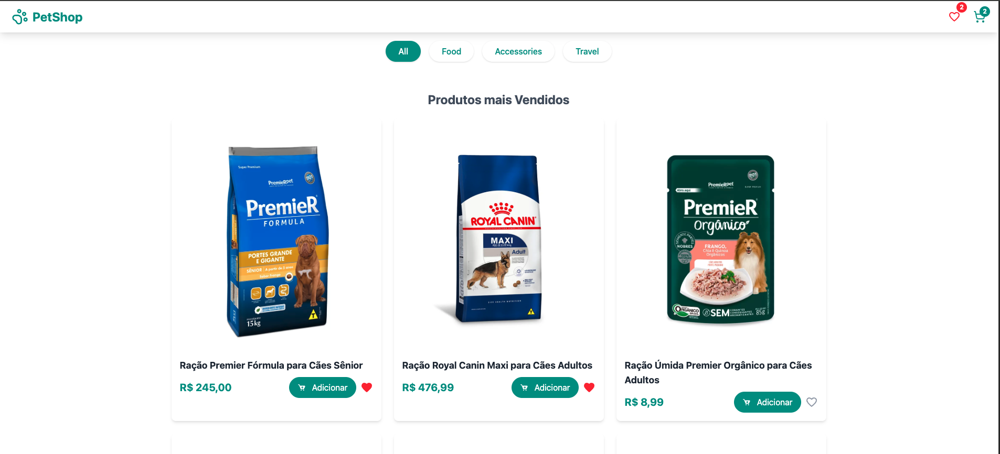
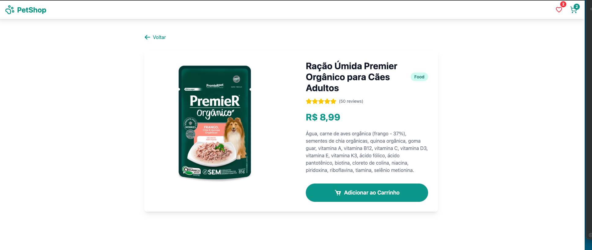

# Projeto Frontend PetShop

Aplicação de e-commerce voltada para produtos pets. O utilizador pode visualizar produtos, adicionar itens ao carrinho e marcar itens como favoritos.



## Tecnologias Utilizadas:

- [React.js](https://reactjs.org/) - Biblioteca JavaScript para construção de interfaces
- [React Router Dom](https://reactrouter.com/)- Gerenciamento de rotas
- [React Hot Toast](https://react-hot-toast.com/) - Sistema de notificações e alertas
- [TailwindCSS](https://tailwindcss.com/) - Framework CSS para estilização
- [TypeScript](https://www.typescriptlang.org/) - Superset JavaScript para tipagem estática
- [Vite](https://vitejs.dev/) - Build tool e ambiente de desenvolvimento rápido para projetos JavaScript
- [React Icons](https://react-icons.github.io/react-icons/) - Biblioteca de ícones para React
- [Axios](https://axios-http.com/docs/intro) - Cliente HTTP baseado em Promises para fazer requisições
- [Json Server](https://github.com/typicode/json-server) - Biblioteca para criar uma API REST fake para desenvolvimento e testes

## Funcionalidads:

 - Listagem de Produtos
 - Página Detalhes do Projecto
 - Carrinho de Compras
 - Pagina de Favoritos


## 🖥️ Como executar o projeto

1. Clone o repositório:
    ```bash
    https://github.com/Leonildo-Gomes/PetShop.git
    ```

2. Instale as dependências:
  ```bash
  cd petshop
  npm install
  ```

3. Execute o projeto:
    ```bash
    npm run dev
    ```
A aplicação estará disponível em: `http://localhost:5173`


## 📂 Estrutura do Projeto

```
 src/
 ├── components/
 │   ├── header/
 │   ├── layout/
 │   ├── loading/
 │   └── productCart/
 ├── context/
 │   ├── FavoritesContext.tsx
 │   └── CartContext.tsx
 ├── pages/
 │   ├── home/
 │   ├── detail/
 │   ├── cart/
 │   ├── favorites/
 │   └── notFound/
 ├── services/
 │   └── api.tsx
 └── App.tsx
 ```


 